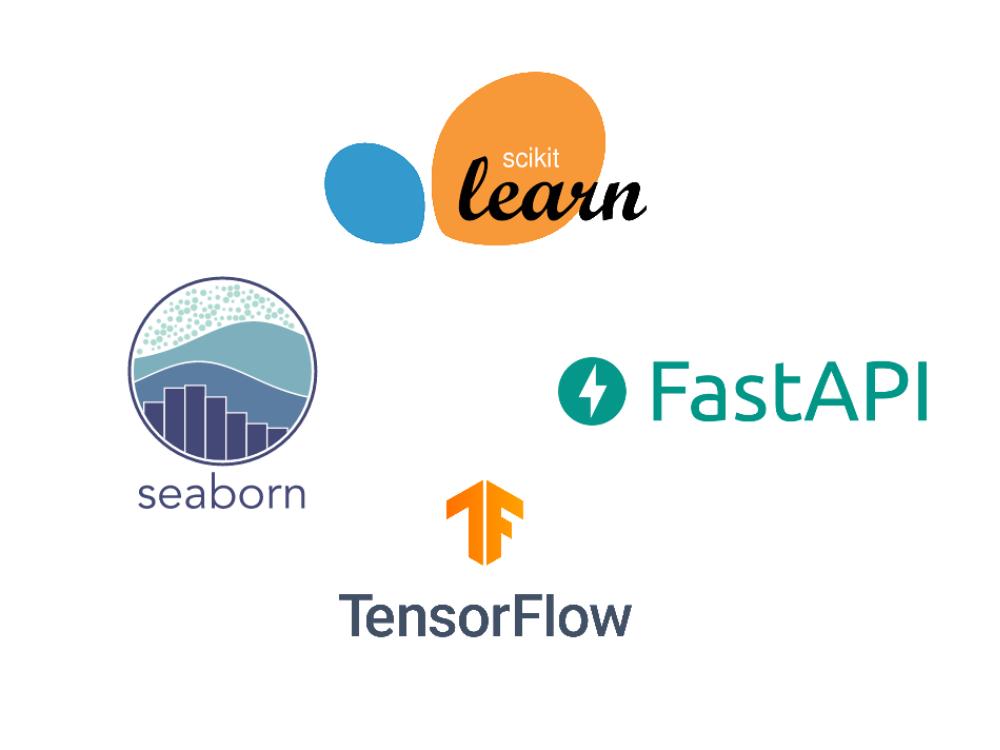
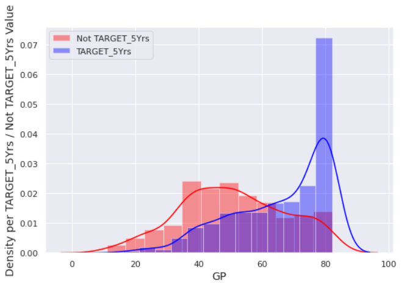
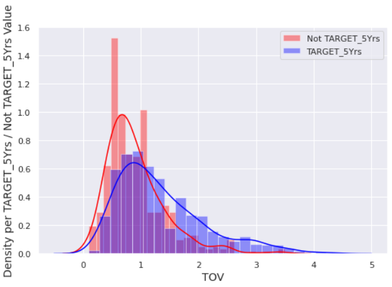
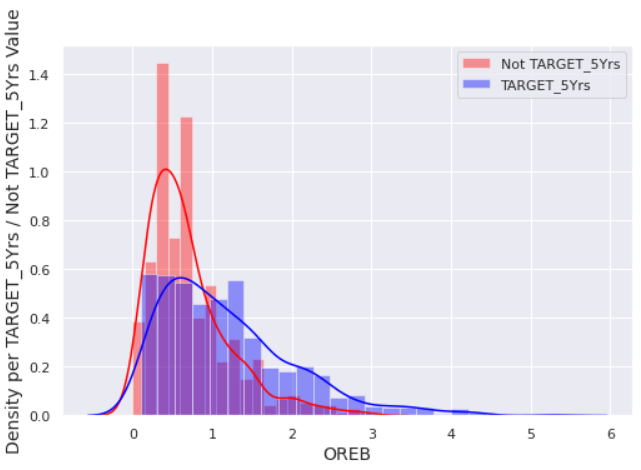
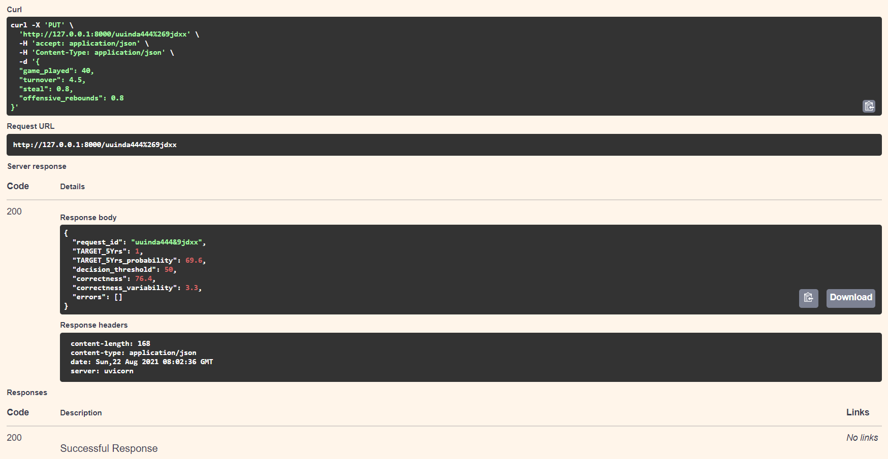

# Technical Interview - NBA Predictor Is your favorite player going to last more than 5 years ?

🧐💯 A simple technical inverview passed for a Data Scientist position. The subject is "given the sample data [nba_logreg.csv](/interview-nba5years/resources/nba_logreg.csv) provided by an investor specialized in NBA players, are you able to make an AI accessible through REST API capable of predicting if the investment on player is worth or not ?"

# Some images

**Some EDA on the training data**

GP | TOV
:-:|:-:
 | 

 STL | OREB
 :-:|:-:
  | 

**REST API result**

# Want to run or modify the application yourself ?

- Install Python 3.7.1 or Use an Python virtual environnement with Python 3.7.1 (Advised)
- Clone the project to your `directory`
- From your `directory`, run `cd interview-nba5years` a first time
- Install the requirements with `pip install -r requirements.txt`
- From your `directory`, run `cd interview-nba5years` a second time
- Then run `uvicorn restapi:app --reload`
- From a web navigator go to `http://127.0.0.1:8000/docs`
- Happy coding! 😊😊😊

# Possible improvment

- Docstings to do for the Python codes
- Use `seed` when training the model for the reproductibily
- Prepare a Dockerfile and test the container deployment on Heroku for example (it's free)
- ...? If you, reader have anything else in mind I am happy to hear it ! 🤓

# References

The links used to achieve the interview.

**Google colab**

- 🧰 [Google colab](https://research.google.com/colaboratory/) for the EDA, Feature engineering & Modelization part. If free computing resources are available, just use them right ? 🤣
- The following files are from the work done on Google colab - [eda.ipynb](/interview-nba5years/eda.ipynb), [model.ipynb](interview-nba5years/model.ipynb).
- The repository [models](/interview-nba5years/resources/models) contains the elements necessary for the deployment.

**REST API**

- [Fast API](https://fastapi.tiangolo.com/) framework, high performance, easy to learn, fast to code, ready for production